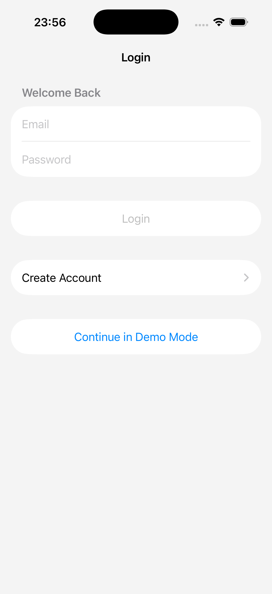
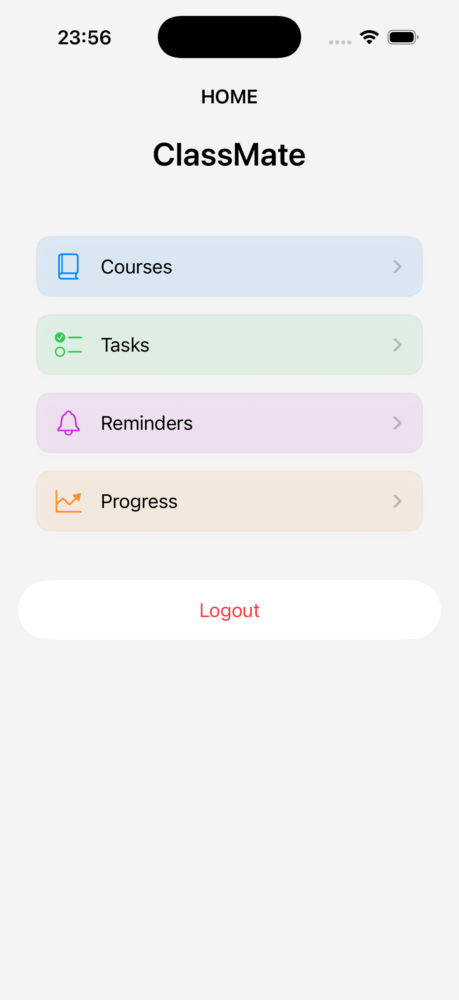
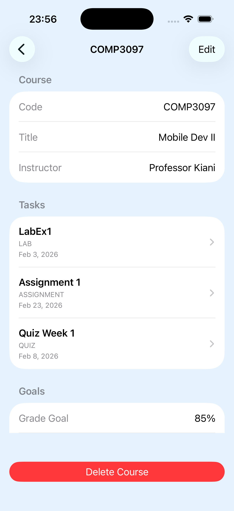
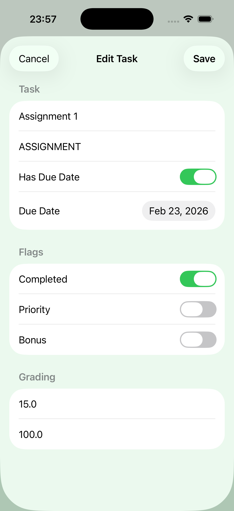
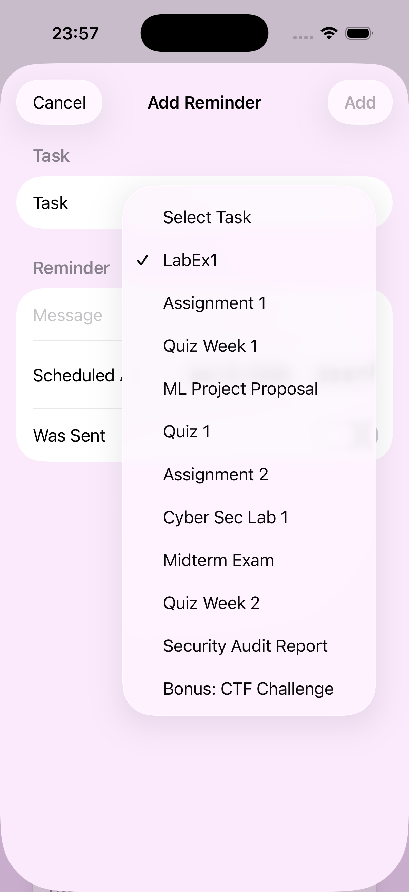
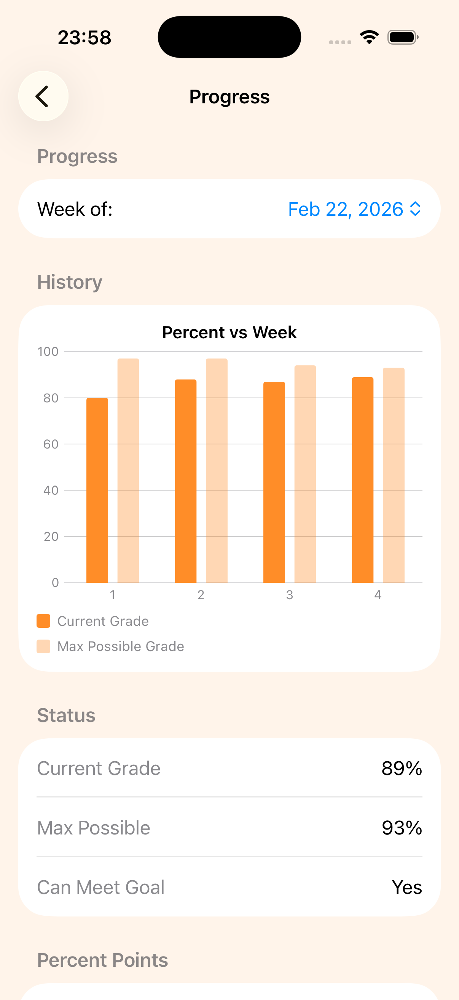

# 📱 ClassMate — iOS Student Productivity App


> **SwiftUI-based academic management app with resilient demo-mode architecture and full CRUD functionality.**

---

## 🚀 Overview

**ClassMate** is a modern iOS application designed to help students manage their academic workload through **courses, tasks, reminders, and performance tracking**.

The app is built with a strong focus on:

* clean architecture
* real-world backend integration
* resilient user experience under unreliable network conditions

To ensure a smooth demonstration experience, the app includes a **fully functional demo mode** that activates when the backend (hosted on a free-tier deployment) is unavailable.

---

## ✨ Features

### 🔐 Authentication

* Login & Registration via REST API
* Persistent session management
* Demo mode fallback when backend is unavailable

---

### 📚 Course Management

* Create, edit, and delete courses
* Track instructor and grade goals
* Organized, card-based UI

---

### ✅ Task Tracking

* Manage assignments, labs, quizzes, and exams
* Track:

  * due dates
  * completion status
  * priority
  * grading weight and score

---

### ⏰ Reminders

* Link reminders to tasks
* Schedule events and notifications
* Keep track of upcoming deadlines

---

### 📊 Progress Visualization

* Track performance over time
* View:

  * current grade
  * maximum possible grade
  * goal feasibility
* Interactive chart visualization

---

### ⚡ Resilient User Experience

* Demo mode with realistic sample data
* Optimistic UI updates
* Error handling with retry options
* Local caching using UserDefaults

---

## 🧠 Architecture

The app follows a **modular, scalable architecture**:

```
SwiftUI Views
    ↓
AppStore (State + Business Logic)
    ↓
Service Layer (API abstraction)
    ↓
NetworkManager (Generic HTTP layer)
    ↓
Backend API
```

### Key Design Decisions

* **Centralized State (`AppStore`)**

  * Single source of truth for all data
  * Handles loading, errors, caching, and demo mode

* **Separation of Concerns**

  * Views → UI only
  * Services → API logic
  * NetworkManager → request handling

* **Demo Mode Architecture**

  * Seamless fallback when backend is unavailable
  * Uses structured local data (`ClassMateDemoData`)
  * Keeps app fully functional during demos

---

## 🛠️ Tech Stack

* **Language:** Swift
* **Framework:** SwiftUI
* **Concurrency:** async/await
* **Networking:** URLSession + custom NetworkManager
* **Architecture:** MVVM + Centralized Store
* **Persistence:** UserDefaults (caching)
* **Charts:** Swift Charts

---

## 📸 Screenshots

---

### 🔐 Login & Demo Mode



**Caption:**
Users can log in or register using the backend API. If the backend is unavailable (due to free-tier hosting), the app provides a **Demo Mode** option, allowing full access with local data.

---

### 🏠 Home Dashboard



**Caption:**
The home screen acts as a central navigation hub, giving users quick access to Courses, Tasks, Reminders, and Progress. A single logout action is placed at the bottom for clarity and consistency.

---

### 📚 Courses



**Caption:**
Users can view and manage courses, including instructor details and grade goals. The UI uses reusable card components and supports full CRUD operations with optimistic updates.

---

### ✅ Tasks



**Caption:**
The tasks screen allows users to manage assignments and track completion status, due dates, and grading information. Tasks are visually structured for quick scanning and prioritization.

---

### ⏰ Reminders



**Caption:**
Reminders are linked to tasks and help users stay on track with deadlines. Each reminder includes a message, scheduled date, and status.

---

### 📊 Progress Tracking



**Caption:**
The progress screen provides a visual breakdown of academic performance over time, including current grade, maximum achievable grade, and goal tracking through interactive charts.

---

## ⚙️ Running the Project

---

```bash
git clone https://github.com/PennyAhlstrom/comp3097-project-group9.git
```

1. Open in **Xcode**
2. Build and run on simulator or device

---

## ⚠️ Backend Note

The backend is deployed on a **free-tier hosting service**, which may:

* take time to wake up
* be temporarily unavailable

To ensure reliability during demos, the app includes a **Demo Mode fallback**, allowing full interaction without backend dependency.

---

## 📈 Future Improvements

* Push notifications for reminders
* Migration to production-grade backend hosting

---

